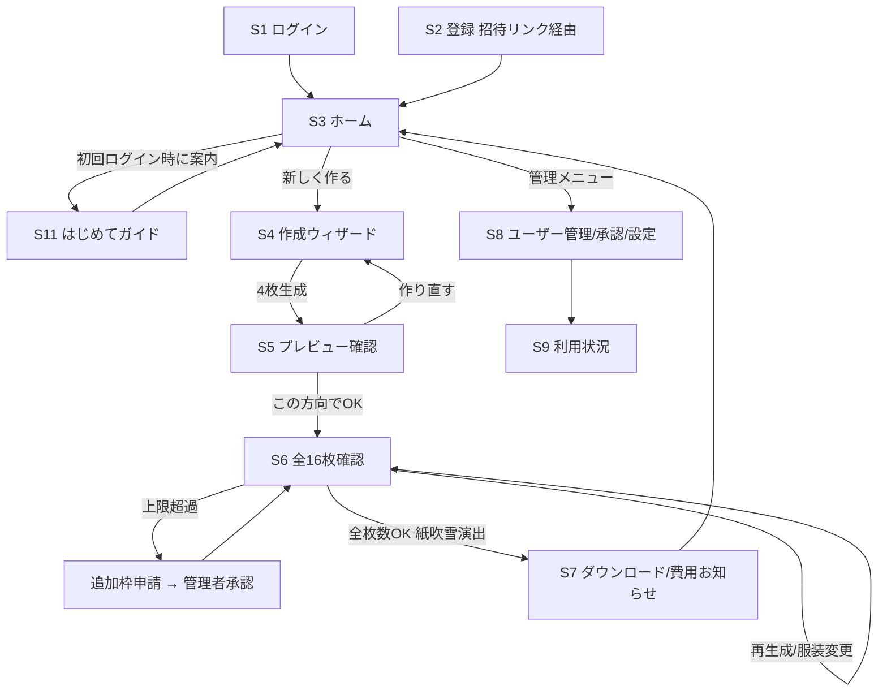

# LINEスタンプメーカー Webアプリ 実装仕様書 v1.0（確定版）

#LINEスタンプ #Webアプリ #招待制 #AI画像生成 #GPTImage #Vercel #Supabase #仕様書 #実装指示書

- 作成日：2026-07-04
- 発注者：KOGAホールディングス株式会社 専務取締役 比嘉俊一
- 本書は打ち合わせで全事項を確定済みの実装仕様書である。実装AI（Claude Code / Codex等）は本書単体で実装を完遂すること。

---

## 1. プロジェクト概要

- **目的**：知り合い限定で配布する「人物写真→LINEスタンプ風キャラクター画像セット」生成Webアプリを提供する
- **ターゲットユーザー**：管理者（比嘉俊一様）から招待を受けた知人。パソコン・スマホ操作に不慣れな人を含む
- **解決する課題**：LINEスタンプの自作にはイラスト制作・規格対応（サイズ・透過・余白）の知識が必要でハードルが高い。本アプリは質問に答えて写真を送るだけで、申請規格に沿ったスタンプ一式が手に入る
- **完成イメージ要約**：管理者がLINEで案内→返信者に招待リンクを発行→本人が登録。5問のヒアリング＋写真アップでAIが文字入りスタンプを先行4枚生成→確認後に残り12枚生成→1枚単位の再生成（上限5回）・服装変更（上限3回、超過は管理者承認で＋3回）→完成時に紙吹雪演出と実費ベースの費用お知らせ→LINE申請規格のZIPをダウンロード（90日間再取得可）。管理者はユーザー管理・追加枠承認・利用状況/コストの確認ができる
- **配布形態**：不特定多数への販売はしない。招待制のクローズドWebアプリ
- **基盤（確定）**：GitHub（コード管理）＋ Vercel（ホスティング＝アプリの公開場所）＋ Supabase（認証・データベース・ファイル保管）
- **画像生成（確定）**：OpenAIのGPT Image系API（実装時点の最新安定モデル。2026年7月現在は gpt-image-2）。品質は Medium を標準とする
- **利用者権限**：管理者／一般ユーザーの2種

---

## 2. 画面一覧・画面遷移

### 2-1. 画面一覧（全11画面）

| # | 画面名 | 権限 |
|---|--------|------|
| S1 | ログイン画面 | 全員 |
| S2 | 登録画面（招待リンクから遷移） | 招待リンク保持者 |
| S3 | ホーム（マイスタンプ一覧） | 一般・管理者 |
| S4 | 新規作成ウィザード（ヒアリング＋写真アップロード） | 一般・管理者 |
| S5 | プレビュー確認画面（先行4枚） | 一般・管理者 |
| S6 | 全16枚確認画面（個別再生成・服装変更） | 一般・管理者 |
| S7 | 書き出し・ダウンロード画面（費用お知らせ含む） | 一般・管理者 |
| S8 | 管理：ユーザー管理・申請承認・アプリ設定 | 管理者のみ |
| S9 | 管理：利用状況ダッシュボード | 管理者のみ |
| S10 | エラー・メンテナンス画面（共通） | 全員 |
| S11 | はじめてガイド（使い方マニュアル） | 一般・管理者 |

### 2-2. 画面遷移図



---

## 3. 画面別詳細仕様

### S1. ログイン画面
- レイアウト：1カラム中央寄せ（最大幅420px）。上からアプリロゴ＋タイトル「LINEスタンプメーカー」、説明文「招待された方専用のアプリです」、メールアドレス欄、パスワード欄、ログインボタン
- ログインボタン：横幅いっぱい、背景 `--accent`（#E86C3A）、白文字、角丸12px、ラベル「ログインする」。押下後「ログイン中…」表示に変化し二重送信を防ぐ
- エラー時：メール／パスワード不一致は注意ボックスで「メールアドレスまたはパスワードが違います」（アカウント有無を漏らさないため未登録アドレスも同一文言）
- 停止中ユーザー：「このアカウントは現在利用できません。管理者にお問い合わせください」
- 新規登録リンクは置かない。下部に13pxグレーで「利用には招待が必要です。管理者にお問い合わせください」
- 「パスワードを忘れた方」リンク→メール入力→再設定メール送信（Supabase標準機能）

### S2. 登録画面（招待リンク経由）
- 有効な招待リンクからのみ到達。無効・使用済み・期限切れ・取り消し済みリンクの場合：注意ボックス「この招待リンクは使えません。招待してくれた方にご連絡ください」のみ表示し、フォームは出さない
- 表示項目：ヘッダー「ようこそ！🎉」＋説明文「メールアドレスとパスワードを決めて、利用をはじめましょう」／メールアドレス欄（本人入力。補足文「パスワードを忘れたときの再設定に使います」）／新パスワード欄／確認用欄／同意チェック「アップロードした写真はスタンプ生成にのみ使用し、期間経過後に削除されることに同意します」（必須）／「利用をはじめる」ボタン
- パスワード条件：8文字以上。未達時は欄直下に赤字14pxで「8文字以上で入力してください」
- 登録完了と同時に招待リンクは無効化。S3へ自動遷移し、成功ボックス「登録が完了しました！さっそくスタンプを作ってみましょう」＋初回のみ「📖 はじめてガイドを見る／あとで見る」の2ボタンを提示（「見る」でS11へ）

### S3. ホーム（マイスタンプ一覧）
- ヘッダー：オレンジグラデーション（4章準拠）。バッジ「招待制アプリ」、タイトル「🎨 LINEスタンプメーカー」、説明文「しゃしんと5つの質問から、あなただけのスタンプを作れます」
- 主ボタン「＋ 新しいスタンプを作る」（背景 `--accent`、白文字、角丸12px、高さ52px、横幅いっぱい）。直下に「今月あと◯セット作れます」（14px）
- 月間上限到達時：ボタンをグレー無効化し「今月の作成回数の上限に達しました」＋「追加をお願いする」リンク（F10申請へ）
- 一覧：過去プロジェクトをカード（角丸16px、白背景、枠線 `--border`）で新しい順に縦並び。各カード＝サムネイル（先頭スタンプ）＋作成日＋ステータスバッジ（下書き／プレビュー確認中／全枚確認中／完成）＋操作ボタン
  - 完成（90日以内）：「ダウンロード」ボタン（ZIP再取得可）
  - 完成（90日超過）：バッジ「保存期間終了」＋ボタン非表示
  - 途中：「つづきから」ボタン
- 空データ時：アイコン＋「まだスタンプがありません。上のボタンから作ってみましょう！」を中央表示
- 読込中：カード形状のスケルトン（灰色プレースホルダー）2枚
- ホーム下部に常設リンク「📖 使い方ガイド」（S11へ）
- 管理者のみ：フッター上に「⚙ 管理メニュー」リンク。承認待ち申請がある場合は赤丸バッジ（件数表示）

### S4. 新規作成ウィザード
1画面1問形式。上部に進捗ドット＋ステップ番号丸数字。「もどる」「つぎへ」を下部固定。画面右上に「✓ 自動保存されています」を12pxグレーで常時表示（各操作時に回答を自動保存）。

| ステップ | 質問 | UI |
|---|------|----|
| 1 | だれのスタンプを作りますか？ | 選択カード5枚（自分／家族／友人／仕事仲間／オリジナルキャラ）。選択で自動的に次へ。※選択肢はデータ上拡張可能な構造とする（将来のペット対応余地） |
| 2 | 肖像権の確認 | チェック必須「はい、本人か、許可をもらった人です」。未チェックだと進めない。補足「有名人や許可のない他人の写真は使えません」 |
| 3 | 写真はありますか？ | 「写真をアップする（1〜3枚）」／「写真なしで特徴を入力する」。アップ時：正面顔推奨の説明＋プレビュー＋削除ボタン。JPG/PNG/HEIC、1枚10MBまで。写真なし時：髪型・服装・雰囲気・年齢感・表情の5項目テキスト入力 |
| 4 | どのくらい似せますか？ | 選択カード3枚（そっくり寄せ／似顔絵寄せ〈おすすめバッジ〉／雰囲気だけ）。そっくり寄せ選択時のみ注意ボックス「本人感が強いスタンプは、公開時に審査・プライバシーの注意が必要です」 |
| 5 | スタンプの雰囲気は？ | 選択カード5枚（仕事・日常用／カジュアル／癒し系／おもしろ系／家族・パートナー向け） |
| 6 | 文字の雰囲気は？ | 選択カード3枚（手描き色文字〈おすすめ〉／ポップ文字／丸文字） |
| 7 | 文言の確認 | 16枚のデフォルト文言リスト（F4）を表示し、各行の文言・文字色を編集可能。編集欄は「文言（テキスト）」「主要色（色チップ8色から選択）」。「このままでOK」ボタンで一括確定も可 |

- 最終確認：選択サマリーカード＋「まず4枚つくる（1〜2分かかります）」ボタン→押下で即生成開始
- 生成中：進捗表示「スタンプを描いています… 1/4枚目」＋CSSのみのローディングアニメーション。ブラウザを閉じても生成は継続し、再ログイン時にS5へ復帰
- API失敗時：注意ボックス「生成に失敗しました。回数は消費されていません。もう一度お試しください」＋再試行ボタン。失敗分は上限にカウントしない

### S5. プレビュー確認画面（先行4枚）
- 4枚グリッド（PC:2×2、スマホ:1列）。LINEトーク画面風背景（薄い水色 #DCF0F8）上に実寸感で表示し「小さくても読めるか」を確認しやすくする
- 内容：①おはようございます ②おつかれさまです ③ありがとうございます ④了解です
- 各カードから「👕 服装を変える」も利用可（F9。S6と共通のセット枠を消費）
- 画面上部に残数常時表示：「作り直し あと◯回／服装変更 あと◯回」
- 下部ボタン：「この方向で残り12枚つくる」（オレンジ主ボタン）／「雰囲気を変えてやり直す」（白背景・オレンジ枠線→S4ステップ4へ。やり直しは1セット1回まで無料、2回目以降は上限消費の旨を事前表示）

### S6. 全16枚確認画面
- 16枚グリッド（PC:4列、スマホ:2列）。完了画像から順次表示、未完了枠はスケルトン＋「描いています…」
- 各画像カード下に3ボタン：「✓ OK」／「↻ 作り直す」／「👕 服装を変える」
  - 作り直す：理由選択（文字が間違っている／表情を変えたい／その他自由記述）→該当1枚のみ再生成
  - 服装を変える：F9のモーダル（小窓）を表示
- 画面上部に常時表示：「作り直し あと◯回／服装変更 あと◯回」
- 上部注意ボックス常設：「文字が正しいか、1枚ずつ確認してください（まちがった文字はAIの生成で起こることがあります）」
- **全16枚OK確定の瞬間：紙吹雪アニメーション（CSSのみ・約1.5秒・色は `--accent`／#FFD700／#2E8B57／ピンクの4色紙片）＋中央に「完成おめでとうございます！🎉」を大きく表示**→下部固定バー「すべてOK！ダウンロードへすすむ」が出現
- 追加枠の申請中でも「今の服装のままOK」を選べる（承認待ちがダウンロードのブロック要因にならない）

### S7. 書き出し・ダウンロード画面
- **初回表示時のみ、費用お知らせモーダル（F11）を表示**：
  - タイトル「💰 費用のお知らせ」
  - 本文「おつかれさまでした！🎉 このアプリはAI画像生成ツール（GPT Image）を使ってスタンプを作っています。今回のスタンプ作成には **約◯◯円** の費用がかかりました（管理者が負担しています）。」
  - 金額はキーワードハイライト（薄黄色 #FFF3CD）で強調。「とじる」ボタンのみ
  - 金額は生成ログの実績から自動計算（F11参照）。2回目以降の画面表示ではモーダルは出さない
- モーダルを閉じた後、S7下部に1行常設：「今回の作成費用：約◯◯円（AI画像生成ツールの利用料）」（14px・グレー）
- 成功ボックス：「LINEスタンプ申請にそのまま使えるサイズに変換しました」
- 内訳リスト（ヒント一覧スタイル）：01.png〜16.png（370×320px・透過）／main.png（240×240px）／tab.png（96×74px）／すべてPNG・各1MB以下・内容の周囲に約10pxの余白
- 主ボタン「ZIPをダウンロード」
- アコーディオン（折りたたみ）「LINEスタンプの申請方法（かんたん3ステップ）」＋LINE Creators Market（LINEの公式申請サイト）へのリンク
- 14px注記：申請代行・審査通過の保証は本アプリの対象外

### S8. 管理：ユーザー管理・申請承認・アプリ設定（管理者のみ）

**セクション1：承認待ちの申請（◯件）**
- 各申請カード＝申請者名／対象セットのサムネイル／枠の種類（服装変更／再生成／月間セット）／申請理由／申請日時＋ボタン「承認する（＋3回）」「却下する」
- 承認時：付与回数を変更可能（初期値＋3回）。却下時：理由入力（任意）
- 処理済みは「履歴」タブで直近90日分参照可。空時：「承認待ちの申請はありません」

**セクション2：招待**
- **案内テンプレ文ブロック**：デザインプロンプト8章の「コピーブロック（ターミナル風・ダーク背景 #1E1E2E、信号ドット3色、コピーボタン）」で表示。ヘッダーラベル「LINEで送る案内文」。コピー完了時ボタンが「コピーしました！」に2秒間変化
  - 初期値（S8内で編集・保存可）：「スタンプを自分で作れるアプリを作りました🎨 しゃしんと5つの質問に答えるだけで、自分のLINEスタンプが作れます。使ってみたい人は返信してください！」
- **招待リンク発行**：「＋ 招待リンクを発行」ボタン→モーダルで表示名（管理用メモ、例「田中さん」）を入力→発行。リンク入りメッセージがコピーブロックで表示
  - 初期値：「お待たせしました！こちらから登録してください（7日間有効です）→ {招待リンク}」
- **招待一覧**：表示名／状態（未使用・登録済み・期限切れ・取り消し）／発行日／操作（「メッセージを再コピー」「再発行」「取り消し」）

**セクション3：ユーザー一覧**
- テーブル（スマホはカード化）：表示名／メールアドレス／状態（利用中・停止中）／今月の使用セット数／月間上限／再生成・服装変更の標準値／操作
- 操作：「上限を変更」（3種の数値）／「停止する」（確認ダイアログ「◯◯さんはログインできなくなります。よろしいですか？」）／「再開する」
- 空時：「まだユーザーがいません。上の招待からはじめましょう」

**セクション4：アプリ設定**
- 費用お知らせ・コスト計算の単価：通常生成 円/枚（初期値8円）、服装変更 円/回（初期値20円）
- 費用お知らせの文言編集（初期値はS7のとおり）
- 案内テンプレ文・招待メッセージの編集（セクション2と同一データ）

### S9. 管理：利用状況ダッシュボード
- 今月カード3枚：総生成枚数／総セット数／概算コスト（S8設定の単価×生成ログ実績で計算、円表示）
- ユーザー別月間生成回数一覧（多い順）、月切替（前月参照可）
- 空時：「今月の利用はまだありません」

### S10. エラー・メンテナンス画面
- 500系：「ただいま混み合っています。少し時間をおいてお試しください」＋ホームへ戻るボタン
- 404：「ページが見つかりませんでした」＋ホームへ戻るボタン

### S11. はじめてガイド
- プロジェクトのデザインプロンプト（初心者向けHTMLマニュアル設計）をそのまま活かした1ページ構成。絵文字見出し・ステップ表現・注意ボックスを使用
- 構成：
  1. 「🎨 スタンプができるまで」：4ステップ図解（①質問に答える→②写真を送る→③できた絵をチェック→④ダウンロードして申請）。ステップ番号丸数字＋接続線で表現
  2. 「📷 きれいに作るための写真のコツ」：ヒント一覧スタイル（正面を向いた写真／明るい場所で撮った写真／1人で写っている写真／帽子・マスクなしがおすすめ）
  3. 「📦 完成したあとのLINE申請のしかた」：3ステップ＋LINE Creators Marketへのリンク＋注意ボックス「申請の審査はLINE社が行います。このアプリは審査の通過を保証するものではありません」
- 各画面のヘッダー付近から戻れる「← ホームにもどる」リンクを上下に配置

---

## 4. デザイン方針

添付の「デザインプロンプト」（HTMLマニュアル デザインシステム）を全画面の正式デザインシステムとして採用する。実装AIは同プロンプトのCSS変数・数値をそのまま実装すること。

### 4-1. 配色（CSS変数）

```css
:root {
  --bg: #FFF8F0;              /* ページ背景：あたたかいクリーム色 */
  --card: #FFFFFF;            /* カード背景：白 */
  --border: #E8E0D8;          /* カード枠線・区切り線 */
  --shadow: 0 2px 12px rgba(0,0,0,0.06);
  --accent: #E86C3A;          /* オレンジ系アクセント（ボタン、番号、見出し色） */
  --accent-light: #FFF0E8;    /* アクセントの薄い背景色 */
  --accent-dark: #C4501E;     /* アクセントの濃い色 */
  --text: #2D2A26;            /* メイン文字色 */
  --text-sub: #6B6560;        /* 補助文字色 */
  --success: #2E8B57;         /* 成功・完了（緑） */
  --success-light: #E8F5EE;
  --highlight: #FFF3CD;       /* キーワードハイライト背景 */
  --copy-bg: #1E1E2E;         /* コピー領域の背景（ダーク） */
  --copy-text: #CDD6F4;       /* コピー領域の文字色 */
  /* コピーブロックのヘッダー/フッター: #313244 */
  /* 信号ドット: 赤 #f38ba8 / 黄 #f9e2af / 緑 #a6e3a1 / ラベル文字色: #a6adc8 */
}
```

- ページ背景は `--bg`（クリーム色）。真っ白にしない。カード背景は `--card`（白）で浮き出させる
- 見出しの色分け：セクション見出しは `--text`、カード内h2/h3は `--accent`
- 本文は `--text-sub`、強調（strong）は `--text`

### 4-2. フォント
- Google Fonts読み込み：`https://fonts.googleapis.com/css2?family=Noto+Sans+JP:wght@400;500;700;900&family=M+PLUS+Rounded+1c:wght@400;500;700&display=swap`
- 本文：'Noto Sans JP', sans-serif／ヘッダーh1：'M PLUS Rounded 1c', sans-serif
- 行間 1.8、`-webkit-font-smoothing: antialiased`
- 文字サイズ階層：ヘッダータイトルh1 28px（スマホ22px, 700, M PLUS Rounded 1c）／ヘッダーバッジ 13px 500／ヘッダー説明文 15px／セクション見出し 20px 700／カード内h2 18px 700／ステップタイトル 17px 700／カード内h3 16px 700／本文 15px／補足・注意書き 14px／コピー対象テキスト 14px（行間2）／フッター 13px／コピーブロック内ラベル 12px 500

### 4-3. 形状・部品（デザインプロンプト準拠）
- レイアウト：1カラム、最大幅780px、中央寄せ（S1/S2のみ420px）。レスポンシブ600px以下対応
- ヘッダー：オレンジグラデーション `linear-gradient(135deg, var(--accent) 0%, #D4582A 100%)`、角丸20px、パディング48px 32px、白文字中央揃え、下マージン48px、::before/::afterで白半透明円（rgba(255,255,255,0.08)）装飾。バッジは半透明白背景（rgba(255,255,255,0.2)）・角丸100pxのピル形状
- カード共通：背景 `--card`、角丸16px、パディング28px 32px（スマホ24px 20px）、影 `--shadow`、枠線1px `--border`
- ステップ番号：36px円形、背景 `--accent`、白文字16px 700、下マージン14px。ステップ間は幅2px高さ20pxの縦線（`--border`）で接続、最後は非表示
- 操作パス（A → B → C 表示）：背景 `--accent-light`、角丸8px、パディング6px 14px、文字 `--accent-dark` 15px 500、矢印は `--accent` 太字
- 注意ボックス：背景 `--accent-light`、左ボーダー4px `--accent`、角丸0 10px 10px 0、パディング16px 20px、文字 `--accent-dark` 14px。タイトル（strong）はblock・下マージン4px
- 成功ボックス：背景 `--success-light`、左ボーダー4px `--success`、同形状、文字 #1a5c36 14px
- コピーブロック：全体角丸14px・overflow hidden・影 0 4px 20px rgba(0,0,0,0.12)。ヘッダー部 #313244・パディング12px 20px・信号ドット3つ（各10px丸）＋ラベル、右側コピーボタン（背景 rgba(255,255,255,0.1)、枠線1px rgba(255,255,255,0.15)、文字 #cdd6f4、角丸8px、ホバー rgba(255,255,255,0.2)、コピー完了時 背景 rgba(166,227,161,0.2)・文字 #a6e3a1、2秒後に復帰）。本体：背景 `--copy-bg`・文字 `--copy-text`・パディング24px・14px 行間2・white-space: pre-wrap・user-select: all。フッター部 #313244・パディング10px 20px・16px丸アイコン（背景 `--accent`・白文字）＋12px #a6adc8 テキスト
- セクション見出し：20px 700、左ボーダー4px `--accent`、左パディング16px、下マージン24px、line-height 1.4
- キーワードハイライト：背景 `--highlight`、パディング2px 6px、角丸4px、500、文字 `--text`、inline
- ヒント一覧：各項目14px `--text-sub`、パディング8px 0、下ボーダー1px dashed `--border`（最後は非表示）、項目内strongは `--text`
- フッター：中央揃え、上マージン56px、上ボーダー1px `--border`・上パディング32px、文字 `--text-sub` 13px、リンク `--accent`・下線なし
- レスポンシブ（600px以下）：container padding 20px 16px 60px／ヘッダー padding 36px 24px／h1 22px／カード padding 24px 20px／コピーブロック本体 padding 16px・13px
- 印刷対応（S11）：`@media print` で背景白・コピーボタン非表示

### 4-4. 本アプリ固有の追加ルール
- 選択カード（ウィザード）：白背景・角丸16px・枠線 `--border`。選択中は枠線2px `--accent`＋背景 `--accent-light`＋左上✓丸バッジ
- 進捗ドット：8px円、現在ステップ `--accent`、未到達 `--border`
- マイクロインタラクション（操作への小さな視覚反応）：ボタンhoverで明度+5%＋影強化（0.15秒）、カード選択時 scale 1.02（0.15秒）。過剰なアニメーション禁止
- 完成時の紙吹雪：CSSのみで実装、約1.5秒、4色紙片（#E86C3A／#FFD700／#2E8B57／ピンク系）、prefers-reduced-motion（動きを減らす設定）有効時は表示しない
- 自動保存表示：「✓ 自動保存されています」12px・`--text-sub`、保存実行時に✓が0.3秒スケールアニメーション
- 見出し先頭に絵文字（🎨 📷 ✨ 👕 💰 📦 📖 等）で親しみやすさを出す
- UI文言の専門用語には必ず（ ）で平易な補足を添える

---

## 5. 機能仕様

### F1. 招待制認証
- アカウント作成は有効な招待リンク経由のみ。自由登録は不可
- ログインはメールアドレス＋パスワード。パスワード再設定はSupabase標準のメール送信機能
- 招待リンク：1人1本・1回限り有効・発行から7日で失効。トークンは推測不可能なランダム文字列（十分な長さ）。生成・検証・無効化はサーバー側で処理
- 停止フラグ付きユーザーは即時ログイン不可

### F2. ヒアリングウィザード
- S4のとおり。回答は各操作時に自動保存。中断・復帰可能

### F3. AI画像生成（先行4枚→本生成12枚）
- OpenAIのGPT Image系APIをサーバー側から呼び出す。APIキーは管理者名義アカウントで取得し、環境変数（サーバーだけに置く秘密情報）として保管。ブラウザには渡さない
- **品質は Medium を標準**とし、環境変数で High へ切替可能な設計とする（370×320への縮小前提ではMediumで十分な品質、コストはHighの約1/4）
- **文字はAI生成画像の中に直接描画する**。後からプログラムで文字を合成する方式は採らない
- プロンプト自動組み立てルール（サーバー側）：
  - キャラクター化：実写そのままにせず手描き風。顔の特徴・髪型・服装・雰囲気を反映。太めの茶色〜濃色アウトライン。表情は大きく、LINEの小さい表示でも伝わるようにする。誇張しすぎず、好印象で親しみやすくする
  - 背景：APIの透過背景オプションを優先使用。非対応ケースは純白 #FFFFFF 指定→透過化処理をフォールバック（代替手段）とする
  - 文字配置：上部に大きく、キャラは下、重ならない。トーク画面で読める大きさ。誤字・文字化け・省略・追加文字は禁止
  - 文字色：単色ベタ禁止。単語ごとに色分けした手描き風色文字（例：「おはよう」赤オレンジ＋「ございます」茶色）。白フチだけが目立つポップ文字ではなく、色そのものが見える文字にする
  - キャラクター一貫性：2枚目以降は1枚目の生成画像を参照画像として入力し、同一キャラを維持する
- **レート制限対応**：APIの毎分生成枚数の上限（新規アカウントはTier 1＝毎分5枚程度）を考慮し、16枚は順次生成とする。進捗はS4/S6の順次表示で見せる
- 生成後の自動処理：①透過確認（必要時は白背景の透過化）②内容と外枠の間に約10px余白を確保し370×320pxへリサイズ ③PNG化・1MB以下へ圧縮
- main.png（240×240）は01番画像から、tab.png（96×74）は同画像の顔まわり中心トリミングから自動生成
- API失敗分は各種上限に不算入（成功のみカウント）

### F4. 16枚のデフォルト文言セット

| # | 文言 | 主要色 | ポーズ | 装飾 |
|---|------|--------|--------|------|
| 01 | おはようございます | 赤オレンジ＋茶 | 笑顔で手を振る | 太陽・黄色い集中線 |
| 02 | おつかれさまです | 緑＋茶 | 丁寧にお辞儀 | 青い汗マーク・小花 |
| 03 | ありがとうございます | ピンク＋茶 | ハートを持ち笑顔 | ピンクの強調線 |
| 04 | 了解です | 青＋茶 | 親指を立てる | 黄色いキラキラ |
| 05 | よろしくお願いします | オレンジ＋茶 | 両手を前でお辞儀 | 小さな星 |
| 06 | 承知しました | 青緑＋茶 | 敬礼ポーズ | 白い光の線 |
| 07 | すみません… | 紫＋茶 | 眉を下げて手を合わせる | 青い縦線 |
| 08 | お先に失礼します | 水色＋茶 | 荷物を持ち小走り | 風の線 |
| 09 | 確認します | 青＋茶 | 虫めがねを持つ | はてなマーク |
| 10 | 少々お待ちください | 黄土＋茶 | 両手を前に出す | 時計マーク |
| 11 | OKです！ | 緑＋茶 | 両腕で大きな丸 | 緑のキラキラ |
| 12 | 助かります | ピンク＋茶 | 両手を胸の前で組む | 小さなハート |
| 13 | がんばります | 赤＋茶 | 両こぶしを上げる | 炎マーク |
| 14 | おやすみなさい | 紺＋茶 | 目を閉じて枕 | 月と星 |
| 15 | また明日 | オレンジ＋茶 | 大きく手を振る | 夕日 |
| 16 | おめでとうございます | 赤＋金＋茶 | クラッカーを鳴らす | 紙吹雪 |

- S4ステップ7で文言・主要色をユーザーが編集可能。ポーズ・装飾は文言に合わせてサーバー側プロンプトが自動調整する

### F5. 個別再生成
- S6で1枚単位の再生成（理由：文字が間違っている／表情を変えたい／その他）。セットあたり上限＝初期値5回。誤字理由でも上限枠を消費する（API費用が発生するため）。上限超過時はF10の申請へ

### F6. 規格変換・ZIP書き出し・再ダウンロード
- S7のとおりZIP一括ダウンロード。ZIP内容：01.png〜16.png（370×320px・透過・各1MB以下・約10px余白）／main.png（240×240px）／tab.png（96×74px）
- 完成スタンプPNGは90日間保持し、S3から再ダウンロード可能。90日経過後は自動削除し「保存期間終了」表示

### F7. ユーザー・権限管理
- 役割は「管理者」「一般」の2種。管理者権限の付与はデータベース上で管理者のみ変更可能

### F8. 生成回数上限管理（確定値）
- 月間セット上限：**2セット/人**（1セット＝プレビュー4枚＋本生成12枚＋再生成枠＋服装変更枠）
- セット内再生成上限：**5回**
- セット内服装変更上限：**3回**
- いずれも到達時はF10の申請フローへ。管理者はS8でユーザー個別に標準値を変更可

### F9. 服装変更機能
- 生成済みスタンプの服装を、顔・ポーズ・文字・装飾を維持したままAIで差し替える。1枚単位、S5・S6の両画面から利用可
- モーダル内容：①現在の画像プレビュー ②服装指示欄（自由テキスト、プレースホルダー「例：青いパーカーとジーンズに変えてください」）③候補チップ：スーツ／白シャツ／パーカー／和服／エプロン／サンタ衣装／浴衣 ④「この服装で作り直す」ボタン
- 処理方式：GPT Image系APIの画像編集機能（元画像＋変更指示を送り、指定部分だけ描き変える機能）を使用。「服装のみ変更、顔・髪型・表情・ポーズ・文字・装飾・配色は維持」の指示をサーバー側で自動付加
- 変更結果は通常の確認フロー（OK／作り直す）に乗せる。「元にもどす」で直前1世代に復元可
- 不適切指示（露出過多・暴力的等）はサーバー側禁止ワード判定で拒否：「この内容では変更できません。別の表現でお試しください」。拒否分は回数不消費
- 【注意】画像編集は服だけを完璧に切り分けられない場合があり、文字が崩れるリスクがある。変更後に文字確認を促す注意ボックスを必ず表示すること
- 上限（3回）到達時：モーダルが申請モードに切替（F10）

### F10. 追加枠の申請・承認
- 申請対象：服装変更枠／再生成枠／月間セット枠の3種共通
- 上限到達時、該当ボタンから申請モーダル：注意ボックス「回数上限に達しました。追加したい場合は、管理者に申請できます」＋申請理由欄（任意200字）＋「追加をお願いする」ボタン
- 申請中は同一セット・同一枠の重複申請不可。ボタンは「申請中です（管理者の承認待ち）」表示
- 管理者承認（S8）：承認1回あたり＋3回付与（承認時に変更可）。却下時は理由入力（任意）
- 反映：承認と同時に即時加算。ユーザーは次の画面表示時に成功ボックス「◯◯があと◯回できるようになりました」。却下時は注意ボックス「今回の追加申請は見送られました」＋却下理由（入力時のみ）
- **申請発生時、管理者へメール通知を送る**（件名例「【スタンプメーカー】追加枠の申請が届いています」。通知先は管理者アカウントのメールアドレス）
- 承認待ち中も他の枚数の確認・「今の服装のままOK」の確定・ZIPダウンロードは可能

### F11. 作成完了後の費用お知らせ表示
- 全16枚OK確定後、S7初回表示時に1回だけモーダル表示（S7のとおり。「とじる」のみ）
- 金額算出：このセットの成功生成枚数（プレビュー4＋本生成12＋再生成分）× 通常単価 ＋ 服装変更回数 × 編集単価。単価はS8アプリ設定（初期値：通常8円/枚、服装変更20円/回）。端数は10円単位で切り上げ「約◯◯円」表示
- モーダル後もS7下部に1行常設再掲：「今回の作成費用：約◯◯円（AI画像生成ツールの利用料）」

### F12. はじめてガイド
- S11のとおり。初回ログイン時に案内、以後ホームから常時参照可

### F13. 完成お祝い演出
- S6で全16枚OK確定の瞬間に紙吹雪＋「完成おめでとうございます！🎉」（4章の仕様どおり）

---

## 6. データ設計

Supabaseのデータベースに以下を保存する（表名・詳細な型は実装AIが決定）。

**ユーザー情報**
| 項目 | 内容 |
|------|------|
| メールアドレス | ログインID |
| 表示名 | 一覧表示用 |
| 役割 | 管理者／一般 |
| 状態 | 利用中／停止中 |
| 月間セット上限 | 数値（初期値2） |
| 再生成上限（セット標準値） | 数値（初期値5） |
| 服装変更上限（セット標準値） | 数値（初期値3） |
| 登録日時 | 自動記録 |

**招待リンク**
| 項目 | 内容 |
|------|------|
| 表示名（管理用メモ） | 管理者が入力 |
| 招待トークン | ランダム文字列 |
| 状態 | 未使用／登録済み／期限切れ／取り消し |
| 有効期限 | 発行から7日 |
| 発行日時・使用日時・登録ユーザー | 自動記録 |

**スタンププロジェクト（1セット＝1件）**
| 項目 | 内容 |
|------|------|
| 所有ユーザー | 作った人 |
| ヒアリング回答 | 対象人物種別・似せ度・雰囲気・文字スタイル・特徴テキスト |
| 文言リスト | 16件の文言・色指定（ユーザー編集後の値） |
| 状態 | 下書き／プレビュー生成中／プレビュー確認中／本生成中／全枚確認中／完成 |
| 残回数 | 再生成残・服装変更残（承認加算を含む現在値） |
| 費用お知らせ表示済みフラグ | 初回表示制御用 |
| 作成日時・完成日時 | 自動記録 |

**生成画像（1枚＝1件）**
| 項目 | 内容 |
|------|------|
| 所属プロジェクト・番号（01〜16／main／tab） | 紐づけ |
| 画像ファイルの場所 | Supabaseストレージ（ファイル置き場）内のパス |
| 確認状態 | 未確認／OK／再生成依頼 |
| 再生成回数 | 数値 |
| 服装変更履歴 | 指示テキスト・実行日時・変更前画像の場所（直前1世代分保持） |
| 削除予定日 | 完成から90日。日次自動処理で物理削除 |

**アップロード写真**
| 項目 | 内容 |
|------|------|
| 所属プロジェクト | 紐づけ |
| ファイルの場所・アップ日時 | 自動記録 |
| 削除予定日 | 生成完了＋7日。日次自動処理で物理削除 |

**追加枠申請**
| 項目 | 内容 |
|------|------|
| 申請者・対象プロジェクト | 紐づけ |
| 枠の種類 | 服装変更／再生成／月間セット |
| 申請理由 | 任意テキスト（200字） |
| 状態 | 申請中／承認／却下 |
| 付与回数・却下理由 | 管理者の処理内容 |
| 申請日時・処理日時 | 自動記録 |

**生成ログ**（上限管理・費用計算用）
| 項目 | 内容 |
|------|------|
| ユーザー・プロジェクト・生成種別（プレビュー／本生成／再生成／服装変更）・成否・日時 | 自動記録。失敗分は上限・費用に不算入 |

**アプリ設定**
| 項目 | 内容 |
|------|------|
| 費用単価（通常生成・服装変更） | 管理者が編集（初期値8円／20円） |
| 費用お知らせ文言 | 管理者が編集（初期値あり） |
| 案内テンプレ文・招待メッセージ | 管理者が編集（初期値あり） |

- アクセス制御：一般ユーザーは自分のデータのみ読み書き可、管理者は全件参照可。RLS（行単位のアクセス制限＝データの行ごとに見られる人を制限する仕組み）を必ず有効化すること

---

## 7. 非機能要件

- レスポンシブ：PC・スマホ両対応。ブレークポイント600px。写真アップはスマホのカメラロールから直接可能
- 表示速度：一覧・ウィザード画面は3秒以内に初期表示。生成待ちは進捗表示で体感を緩和
- セキュリティ：APIキーはサーバー側のみ／全通信HTTPS／写真・生成画像のURLは本人と管理者以外アクセス不可（署名付きの期限付きURLを使用）／招待トークンは推測不可能な長さ
- プライバシー：顔写真は生成完了後7日で自動削除。S2で同意取得。完成PNGは90日で自動削除
- アクセシビリティ：本文15px以上、タップ領域最小44×44px、色だけに頼らない状態表示（バッジに文言併記）、prefers-reduced-motion対応（紙吹雪等を無効化）

---

## 8. 実装AIへの指示

- **確定基盤**：GitHubでコード管理、Vercelへデプロイ（公開）、Supabaseを認証・データベース・ファイル保管に使用すること。この範囲内でのフレームワーク（開発の土台となる部品集）・ライブラリの選定は実装AIに委任する。ただしVercelのサーバー側処理（OpenAI API呼び出し・画像加工・ZIP生成・日次削除処理）が成立する構成を選ぶこと
- 画像生成はOpenAIのGPT Image系API（実装時点の最新安定モデル）を使用。品質Medium標準・環境変数で切替可。API呼び出し・画像加工（透過・リサイズ・圧縮）・ZIP生成・招待トークン処理はすべてサーバー側で行い、ブラウザに秘密情報を置かないこと
- APIのレート制限（毎分生成枚数の上限）を考慮し、16枚は順次生成とし、進捗を画面へ逐次反映すること
- 環境変数（Supabase接続情報、OpenAI APIキー、画像品質設定、管理者初期メールアドレス）をREADMEに一覧化すること
- 日次の自動削除処理（写真7日・完成PNG90日）を実装すること（Vercelの定期実行機能等）

### 完成の定義（受け入れ条件）
1. 管理者が招待リンクを発行→リンクから本人がメール・パスワードを設定→ログインまで一連で動作する。使用済み・期限切れ・取り消し済みリンクでは登録できない
2. ウィザード完了から4枚プレビュー表示まで人手の介在なく動作する
3. 承認後に残り12枚が生成され、個別再生成が機能する
4. ZIPに01〜16.png（370×320・透過・各1MB以下・約10px余白）、main.png（240×240）、tab.png（96×74）が含まれる
5. 停止中ユーザーがログインできない／一般ユーザーが他人のデータ・管理画面にアクセスできない
6. 月間上限到達時に新規作成がブロックされる
7. スマホ（幅375px）でも全画面が崩れず操作できる
8. S6で任意の1枚に服装変更→結果表示→「元にもどす」で復元、まで一連で動作する
9. 服装変更枠（3回）を使い切る→申請→管理者承認（＋3回）→枠加算→再度変更できる、まで一連で動作し、申請時に管理者へメール通知が届く
10. 却下時にユーザー側へ却下表示が出て、新規申請可能な状態に戻る
11. 全16枚確定後にS7を初回表示した際、費用お知らせモーダルが実績枚数に基づく金額で表示される。2回目以降はモーダルが出ず、下部の1行再掲のみ残る
12. 全16枚OK確定時に紙吹雪演出が表示される（動きを減らす設定時は非表示）
13. 完成セットが90日以内ならS3から再ダウンロードできる
14. S11ガイドが表示され、初回ログイン時に案内が出る

### 動作確認の観点リスト
- 写真なしフローの生成
- HEIC写真のアップロード
- 生成API失敗時の回数・費用不消費
- ブラウザを閉じた後の生成継続と復帰
- 自動保存表示の動作
- 肖像権チェック未同意時の進行不可
- 再生成・服装変更それぞれの上限到達時の表示
- 申請中の重複申請ブロック
- 承認バッジ件数表示／承認時の付与数変更
- 申請中でもZIP確定が可能なこと
- 服装変更後の文字・顔・ポーズ維持確認
- 禁止ワード指示の拒否表示
- 費用金額が生成実績（再生成・服装変更含む）と管理画面の単価変更を正しく反映すること
- 招待リンクの2回目アクセス拒否・期限切れ表示・取り消し後の無効化
- テンプレ文のコピー動作
- 写真7日・完成PNG90日の自動削除
- ZIP内ファイルのサイズ・透過・余白の実測確認

---

## 9. スコープ外（今回作らないもの）

- LINE Creators Marketへの申請代行・自動連携、審査通過の保証
- 不特定多数向けの公開登録・課金/決済機能
- ネイティブアプリ（iOS/Android）※スマホブラウザで完結
- スタンプ以外の画像生成（アイコン・絵文字・アニメーションスタンプ）
- 全16枚一括の服装変更（v2候補）
- 完成済みセットへの服装変更・再ZIP化（v2候補）
- ペット等、人物以外のキャラクター化（v2候補。S4ステップ1の選択肢構造のみ拡張余地を確保）
- 複数管理者の階層権限（管理者は当面1名想定）
- 多言語対応（日本語のみ）
